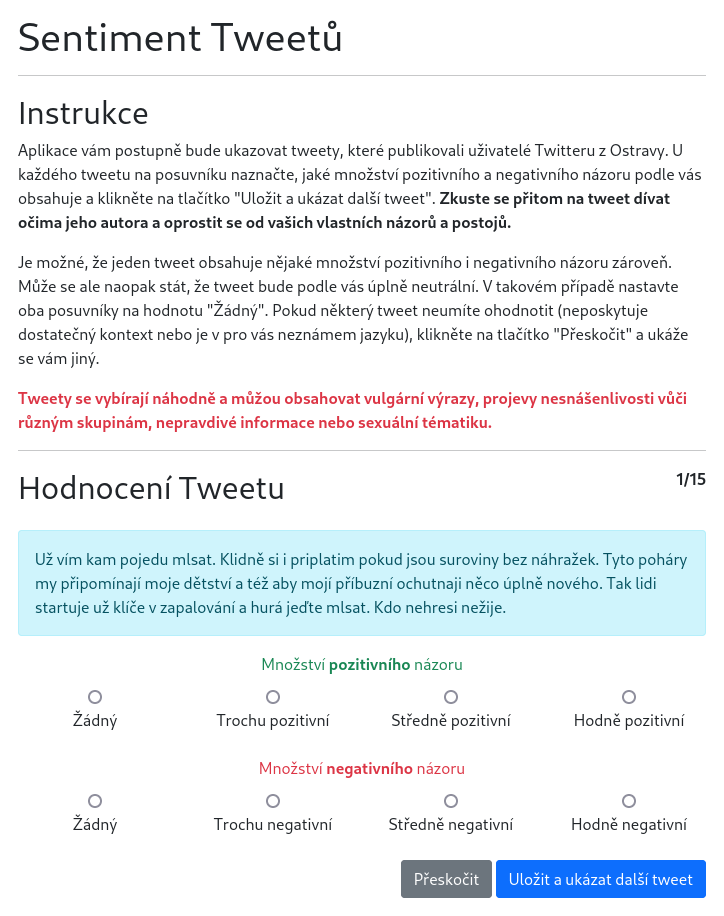

# Sentiment Survey

This project implements a simple sentiment survey. Respondents are shown a series of
tweets and asked to determine the amount of positive and negative sentiment.

Tweets are picked randomly from a CSV file (which is not made publically available).
Each tweet evaluation is stored in another CSV file for further analysis.

This sentiment analysis survey is a part of my dissertation research which focuses on
using social media data, sentiment analysis and topic modeling as decision support tools
for municipal decision-making.

The survey is indended for respondents from Czechia so the interface is in Czech.



## Starting the Application

### Option 1: NodeJS

```bash
$ npm install
$ node app.js
```

The app now runs at http://localhost:3000